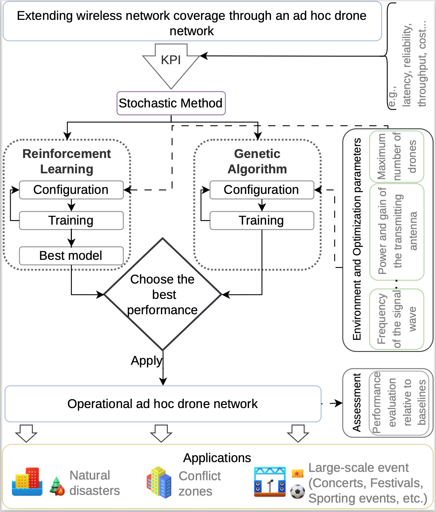

# IDPR - Intelligent Drone Positioning and Routing



## Abstract

This paper investigates the use of Unmanned Aerial Vehicles (UAVs) to establish temporary aerial backhaul networks in infrastructure-limited and contested environments. The objective is to jointly optimize drone positioning and routing to minimize end-to-end latency while satisfying reliability and throughput constraints for mission-critical communications. The proposed framework establishes a multi-hop aerial relay network that connects remote operational areas to existing communication infrastructure. Two optimization techniques are evaluated: a Genetic Algorithm (GA) and a Reinforcement Learning (RL) based method. The obtained results show that both approaches outperform baseline deployments, achieving lower latency, higher throughput, and improved reliability, with latency reductions of up to 45% while maintaining Quality of Service (QoS) requirements. These results demonstrate the potential of intelligent UAV networking for resilient and rapidly deployable communications in military and emergency scenarios.

## Methodology and Design

The proposed methodology uses optimization variables derived from the operational requirements and Key Performance Indicators (KPIs) of each target scenario, including latency, reliability, throughput, resilience, and deployment constraints. These parameters define the environment and the QoS objectives to be satisfied by the aerial network. The overall process is illustrated in the workflow figure above.

Both evaluated approaches, GA and RL, operate on the same environment and share the same optimization parameters, ensuring a fair comparison. Each method also requires its own internal configuration and training process. After training, the GA directly produces a drone positioning and routing solution, while the RL generates a trained model for inferring the final network configuration. Performance is evaluated based on the number of drones, reliability, maximum end-to-end latency, redundancy overhead, and execution time. The resulting optimized topology and routing configuration are then compared against baseline deployments.

## Repository Structure

```
IDPR-Intelligent-Drone-Positioning-and-Routing/
├── src/
│   ├── 5GML.py                        # Main PPO training script
│   ├── drone_env.py                   # Gymnasium environment for drone positioning
│   └── calculaProbLink_otimizado.py   # Link reliability calculation module
├── img/
│   └── workflow.png                   # Methodology workflow diagram
├── requirements.txt                   # Python dependencies
└── README.md                          # This file
```

## Installation

To reproduce the proposed model, you need Python 3.8 or higher. It is recommended to use a virtual environment.

1. Clone the repository:
   ```bash
   git clone https://github.com/yourusername/IDPR-Intelligent-Drone-Positioning-and-Routing.git
   cd IDPR-Intelligent-Drone-Positioning-and-Routing
   ```

2. Create and activate a virtual environment (optional but recommended):
   ```bash
   python -m venv venv
   source venv/bin/activate  # On Windows use: venv\Scripts\activate
   ```

3. Install the required dependencies:
   ```bash
   pip install -r requirements.txt
   ```

## Running the Code

The main entry point for training the Reinforcement Learning (PPO) model is the `5GML.py` script located in the `src` directory.

### Basic Training

To start a basic training session with default parameters:

```bash
cd src
python 5GML.py
```

### Advanced Configuration

The script supports numerous command-line arguments to customize the training process, environment, and neural network architecture. Here are some key parameters:

**Environment Settings:**
- `--grid-size`: Size of the grid (default: 100)
- `--num-drones`: Number of drones in the network (default: 13)
- `--square-size-m`: Physical size of each grid cell in meters (default: 20.0)
- `--variable-drones`: Enable variable number of drones (true/false)

**Training Hyperparameters:**
- `--timesteps`: Total number of training timesteps (default: 40,000,000)
- `--n-envs`: Number of parallel environments (default: 32)
- `--batch-size`: Batch size for PPO update (default: 24576)
- `--n-epochs`: Number of optimization epochs (default: 29)

**Example with custom parameters:**

```bash
python 5GML.py --grid-size 100 --num-drones 25 --timesteps 10000000 --n-envs 16
```

### Hyperparameter Optimization (Optuna)

The script includes built-in support for hyperparameter optimization using Optuna:

```bash
python 5GML.py --hpo-optuna 1 --hpo-trials 30
```

### Monitoring Training

The training process logs metrics to TensorBoard. You can monitor the progress by running:

```bash
tensorboard --logdir ./ppo_drone_tensorboard
```

## License

This project is licensed under the MIT License - see the LICENSE file for details.
